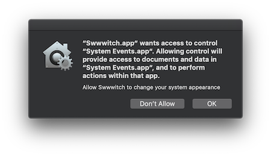

# Swwwitch


Just a swith tutorial.


That switch your system theme needs your authorization. Just click OK.




## Logic Under the hood

1. Switch your system theme using AppleScript
2. Hide / Show your desktop icons using NSTask(aka Process)
3. MenuBar only when your Cocoa Application is agent.
4. Start at login using serviceManagement (embed a helper login app to wake main application up.)


### System Appearance Switch

``` AppleScript
tell application "System Events"
	tell appearance preferences
		set dark mode to not dark mode
	end tell
end tell
```

You can just using ScriptEditor to run this AppleScript to switch the dark theme and light one.

[Click Here to run](applescript://com.apple.scripteditor?action=new&name=Change%20Theme&script=tell%20application%20%22System%20Events%22%0D%09tell%20appearance%20preferences%0D%09%09set%20dark%20mode%20to%20not%20dark%20mode%0D%09end%20tell%0Dend%20tell)


### Hide / Show Desktop Icons

```Shell
defaults write com.apple.finder CreateDesktop false
killall Finder
```

Input the two lines in your terminal, icons just hidden.

If you want recover your icons, just change `false` to `true`.

[Click here to hide Desktop Icons](applescript://com.apple.scripteditor?action=new&name=Hide%20Desktop%20Icons&script=tell%20application%20%22Terminal%22%0D%20%20%20%20do%20script%20%22defaults%20write%20com.apple.finder%20CreateDesktop%20false%3b%20killall%20Finder%22%0Dend%20tell)

[Click here to show Desktop Icons](applescript://com.apple.scripteditor?action=new&name=Hide%20Desktop%20Icons&script=tell%20application%20%22Terminal%22%0D%20%20%20%20do%20script%20%22defaults%20write%20com.apple.finder%20CreateDesktop%20true%3b%20killall%20Finder%22%0Dend%20tell)


## Links

[Checkout all command lines macOS Support](https://ss64.com/osx/)