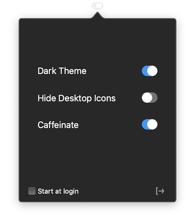

# Swwwitch

Just a tutorial for practise.

## Logic Under the hood

1. Switch your system theme using AppleScript
2. Hide / Show your desktop icons using NSTask(aka Process)
3. MenuBar only when your Cocoa Application is agent.

